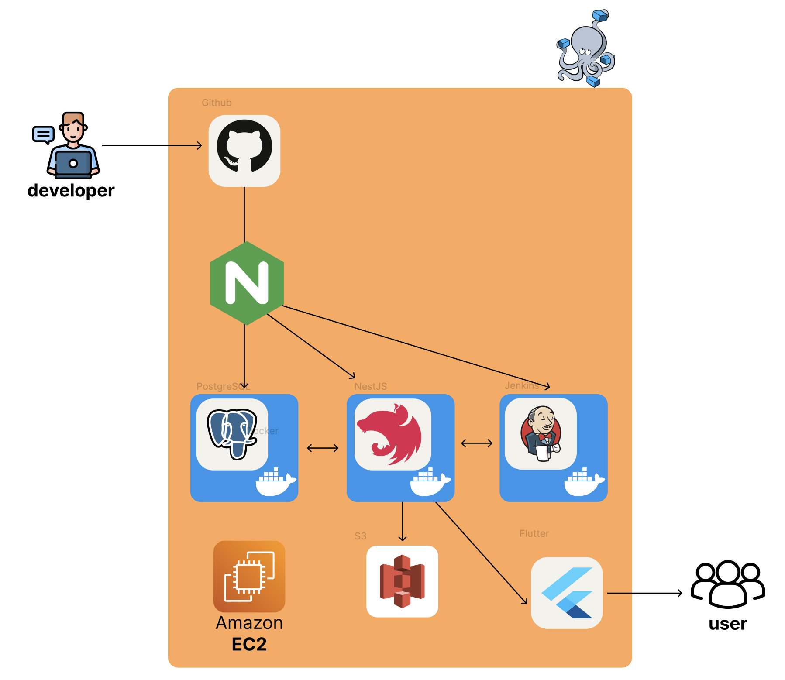
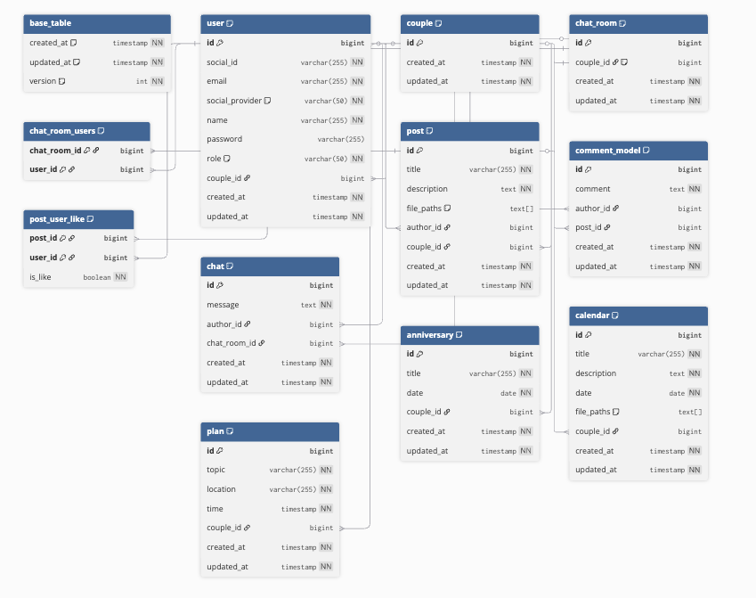
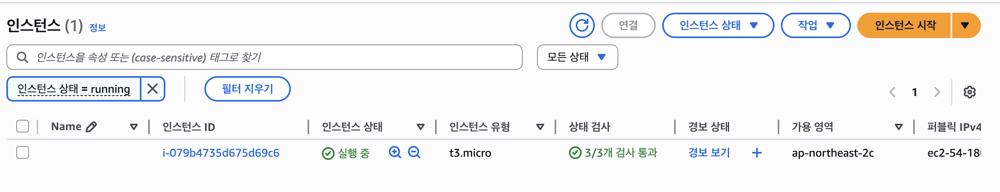
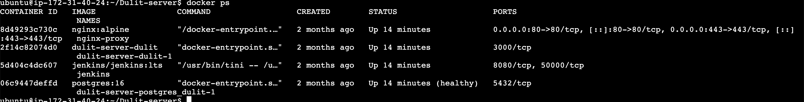
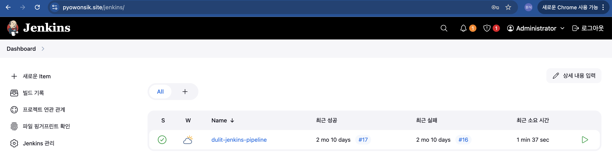
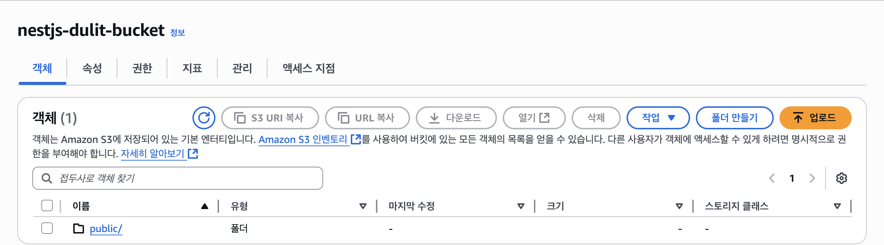
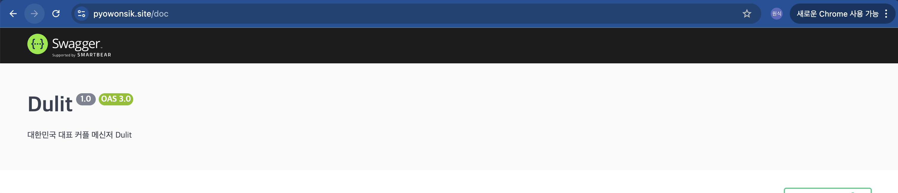

# 둘잇 (Dulit) - 커플 전용 앱 백엔드 서버

NestJS 기반 커플 전용 애플리케이션 백엔드 서버

실시간 채팅, 기념일/약속 관리, 데이트 코스 공유 기능 제공

## 시스템 아키텍처



## ERD



## AWS EC2 배포



## Docker 컨테이너



## Jenkins CI/CD



## S3 스토리지



## API 문서 (Swagger)



> **Swagger 문서**: [https://pyowonsik.site/doc](https://pyowonsik.site/doc)

## 주요 기능

- 카카오 소셜 로그인 (OAuth2 + JWT)
- 실시간 커플 채팅 (Socket.IO)
- 기념일 & 약속 관리 (D-Day 자동 계산)
- 약속 알림 (Cron 스케줄러)
- 데이트 캘린더
- 커뮤니티 게시판 (데이트 코스 공유)
- 실시간 알림 (매칭, 약속 리마인더)

## 기술 스택

**Backend**: NestJS, TypeScript, Node.js

**Database**: PostgreSQL, TypeORM

**Auth**: OAuth2, JWT, Passport

**Real-time**: Socket.IO, WebSocket

**Storage**: AWS S3

**DevOps**: Docker, Docker Compose, Jenkins, Nginx

**Testing**: Jest

## 주요 API

| Domain      | Method | Endpoint              | Description           |
| ----------- | ------ | --------------------- | --------------------- |
| Auth        | POST   | `/api/auth/signin`    | 로그인 (카카오 OAuth) |
| Auth        | POST   | `/api/auth/refresh`   | AccessToken 갱신      |
| User        | GET    | `/api/user/profile`   | 내 프로필 조회        |
| Couple      | POST   | `/api/couple/match`   | 커플 매칭 요청        |
| Chat        | WS     | `/socket.io`          | 실시간 채팅           |
| Anniversary | CRUD   | `/api/anniversary`    | 기념일 관리           |
| Plan        | CRUD   | `/api/plan`           | 약속 관리             |
| Calendar    | CRUD   | `/api/calendar`       | 캘린더 일정           |
| Post        | CRUD   | `/api/post`           | 게시글 관리           |
| Comment     | CRUD   | `/api/post/:id/comment` | 댓글 관리           |

## 실행 방법

```bash
# 의존성 설치
pnpm install

# 개발 서버 실행
pnpm run start:dev

# 프로덕션 빌드
pnpm run build

# Docker Compose로 전체 서비스 실행
docker-compose up -d
```

## 개발

- **개발자**: 표원식 (1인 개발)
- **개발 기간**: 2024.12 ~ 2025.03
- **아키텍처**: 모놀리식 (Monolithic)
- **배포 환경**: AWS EC2 + Docker + Jenkins CI/CD
- **도메인**: [https://pyowonsik.site](https://pyowonsik.site)

## MSA 버전

마이크로서비스 아키텍처로 마이그레이션한 버전은 [dulit-server-msa](https://github.com/pyowonsik/dulit-server-msa)에서 확인하실 수 있습니다.

## 라이센스

MIT License
